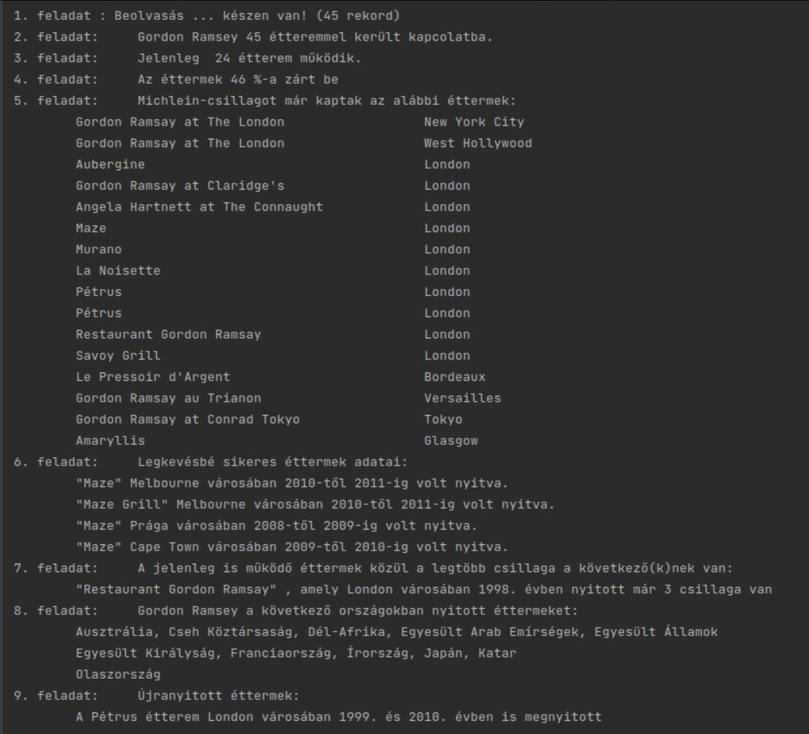

Gordon Ramsay éttermei(programozási feladat)

A népszerű televíziós szakács szerte a világban sok étterem működését segítette. 
Ezek listája található a mellékelt GordonRamsayRestorants.csv nevű, tabulátorokkal tagolt, UTF-8 kódolású szöveges állományban.  
Az első sor a táblázat oszlopainak elnevezését tartalmazza: 
Etterem:  az étterem neve 
Varos:   az a város, ahol az étterem megtalálható 
Orszag:   az az ország, ahol a város van 
Nyitas:  az étterem (újra)nyitásának éve (egész szám) 
Bezaras:  ha az étterem azóta már bezárt, annak az éve, különben 0 
Michelinstar:   az esetleg elnyert Michelin-csillagok száma, ha nincs, 0 
MichelinKezd:   az első év, amelyben a csillagot elnyerte, vagy 0 
MichelinVege:   az utolsó év, amelyikben még volt csillaga. Ha még most is van, ez a mező 0.  

Készítsen a következő elvárásoknak megfelelő számítógépes asztali alkalmazást:  

1.Olvassa be egy alkalmas adatszerkezetbe az állomány tartalmát! 
2.Jelezze ki, összesen hány étteremmel került GR kapcsolatba! 
3.Írja ki a jelenleg is működő éttermek számát! 
4.Számolja ki, hány százalékuk zárt be az adatfelvétel időpontjáig! 
5.Írja ki azokat az éttermeket és városaikat, amelyek kaptak már Michelin-csillagot! 
6.Melyik éttermek voltak a legkevésbé sikeresek (nem kaptak csillagot és a legrövidebb ideig voltak nyitva)? 
7.Melyikek a legjobb (a legtöbb csillaggal rendelkező) és még működő éttermek? 
8.Sorolja fel névsorrendben, ismétlődés nélkül azokat az országokat, amelyekben működése alatt tevékenykedett a sztárszakács! 
9.Volt-e újranyitott étterem ugyanabban a városban? Mikor és hol?
  
Minta kimenet a konzolon :
 

